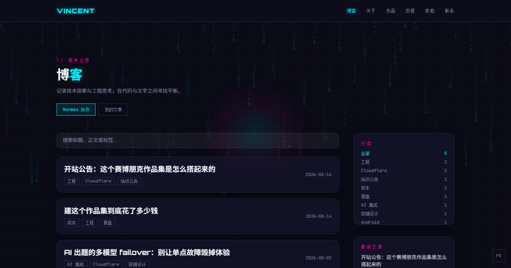
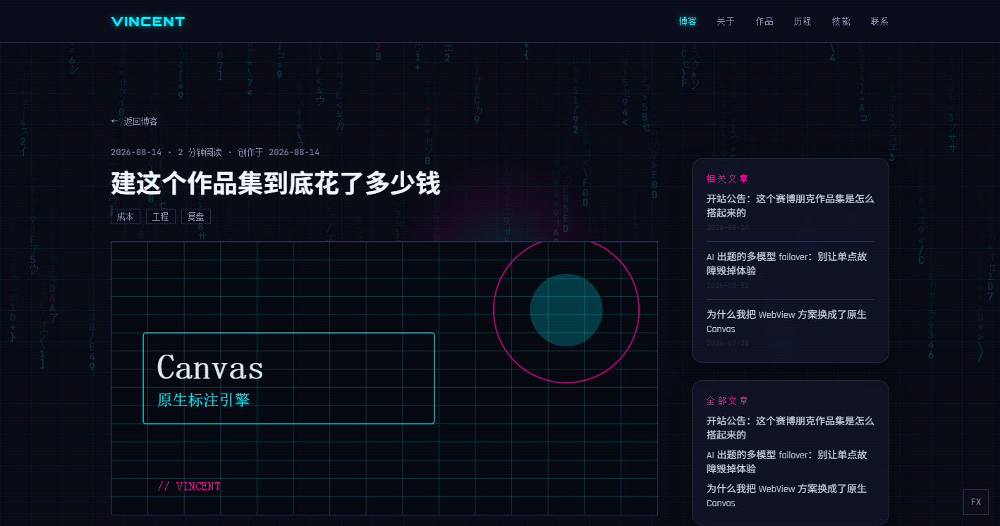
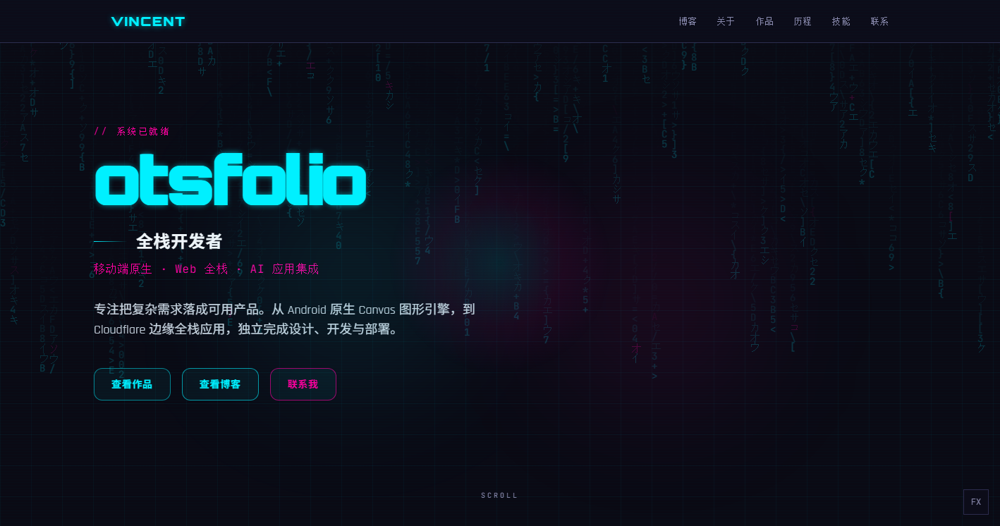

# otsfolio

> 赛博朋克风个人作品集 / Cyberpunk-style personal portfolio.

一个用 **Vite + React + TypeScript + Tailwind CSS** 构建的单页作品集，自带内容管理后台、文章系统、访问统计与一键分享。已部署在 Cloudflare Pages，数据存于 **D1 + R2**。

🌐 线上地址：https://www.otscup.com

---

## 功能

- **赛博朋克视觉**：矩阵雨背景、光标跟随光效、霓虹/故障字标题、滚动进场动画（均响应 `prefers-reduced-motion`）
- **作品集**：支持「精选」勾选（后台勾几个前台展几个）+ 全部作品切换
- **博客系统**：Markdown 撰写、XSS 净化、标签、作者分离（Hermes 协作 / 我的文章）、相关文章 / 全部文章侧栏（按作者隔离）
- **内容管理后台**：文章 / 项目 / 历程 / 技能 / 设置 / 数据统计，改动实时同步云端（D1）
- **访问统计**：全站 PV、真实访问人数（IP 去重）、每篇文章阅读数与时长、近 7/30 天趋势折线图、国家占比甜甜圈（纯 SVG，零图表依赖）
- **一键分享**：复制链接 / Twitter·X / Facebook / 微博
- **评论**：Giscus（配置仓库后启用）

## 截图

| 首页 | 博客列表 | 文章详情 | 作品 |
|---|---|---|---|
|  |  |  |  |


| 层 | 选型 |
|---|---|
| 构建 | Vite |
| 框架 | React 18 + TypeScript |
| 样式 | Tailwind CSS（自定义赛博朋克 token，禁止硬编码颜色） |
| 托管 | Cloudflare Pages（纯静态 + Functions） |
| 数据 | Cloudflare D1（SQLite）+ R2（图片） |
| 鉴权 | D1 存储口令 SHA-256 加盐哈希，云端写接口二次校验 |

## 本地运行

```bash
npm install
npm run dev      # 开发热更新 → http://127.0.0.1:5173
npm run build    # 生产构建 → dist/
npm run preview  # 预览构建产物
npm test         # Markdown 净化单测（34 项）
```

## 页面路由（哈希路由）

| 地址 | 说明 |
|---|---|
| `#/` | 前台首页 |
| `#/blog` | 博客列表 |
| `#/blog/<slug>` | 文章详情 |
| `#/admin` | 内容管理后台（页脚低调 `·` 入口） |

## 目录结构

```
src/
├── types.ts            # 数据契约（SiteData 及各实体类型）
├── store.ts            # 数据访问层（localStorage ↔ D1 双模）
├── defaultSite.ts      # 初始内容（来源 content.ts）
├── content.ts          # 静态文案与导航配置
├── App.tsx             # 路由分发
├── components/         # 前台组件
│   ├── SiteView / Hero / About / Projects / Timeline / Skills / Contact
│   ├── MatrixRain.tsx  # 矩阵雨背景
│   ├── CursorGlow.tsx  # 鼠标跟随光效
│   ├── ScrollProgress.tsx
│   └── BlogPost.tsx     # 文章详情 + 分享 + 阅读埋点
├── admin/AdminPanel.tsx # 内容管理后台 + 统计面板
├── functions/api/      # Cloudflare Pages Functions
│   ├── content.ts      # 内容 GET/PUT（D1 哈希鉴权）
│   ├── login.ts        # 登录校验（D1 哈希）
│   └── track.ts        # 访问埋点 + 聚合统计
└── hooks/              # useSite / useReveal / useHashRoute
```

## 设计系统

禁止硬编码颜色，一律使用 `tailwind.config.js` 语义 token：

| Token | 用途 |
|---|---|
| `void` / `surface` / `elevated` | 背景层级 |
| `cyan` / `magenta` / `lime` | 霓虹主/副/强调色 |
| `muted` | 次级文字 |
| `line` | 描边 |

## 数据存储（云端阶段）

- 内容存于 **D1**（`portfolio-content`），表 `site(id, data, updated_at)`
- 封面图存于 **R2**（`portfolio-assets`），后台上传后保存 URL
- 访问统计存于 D1 `analytics(slug, action, duration, country, ip_hash, day, ts)`
- 后台写接口校验 `settings.adminPassHash`（SHA-256 加盐），与登录同源；云端写接口另有 D1 哈希二次校验
- 前端 `store.ts` 优先读云端，本地 `localStorage` 作缓存

## 部署

详见 [DEPLOY.md](./DEPLOY.md) —— Cloudflare Pages + D1 + R2 完整流程（建库、建桶、wrangler 配置、灌数据、部署、自定义域名、故障排查）。

## License

[MIT](./LICENSE)
